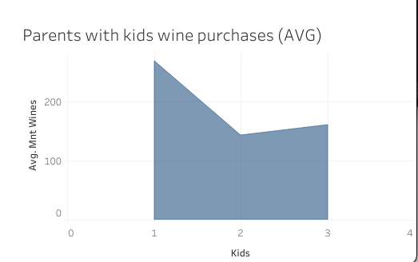
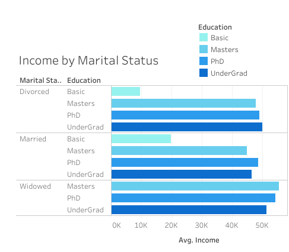
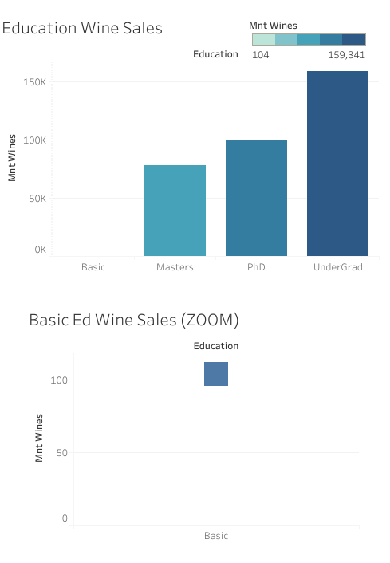
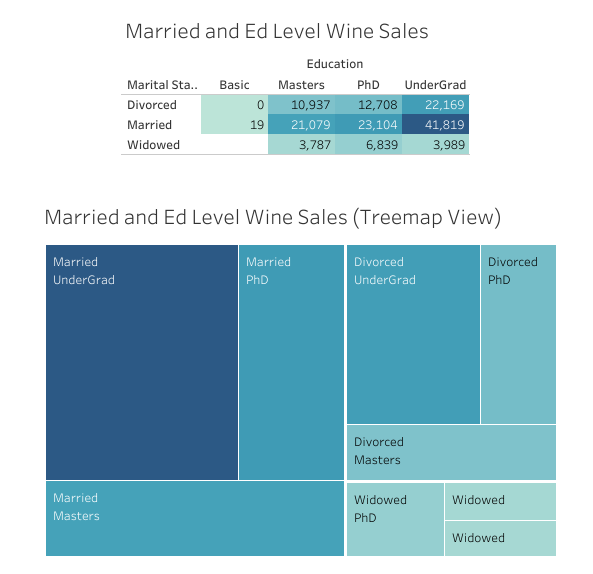
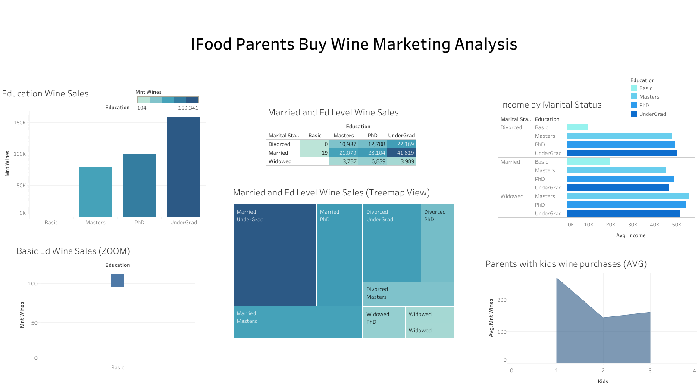

# IFood-Marketing-Analysis
Analysis on wine purchases by parents
 

Tyrone Fraley 
December 2, 2022 

 

  

 
## Overview of the Analysis
This analysis is based on data derived from Kaggle (https://www.kaggle.com/datasets/jackdaoud/marketing-data) . The marketing data was based on Ifood customers wine purchases in the last two years. For this analysis I explored consumer behaviour on the basis of the causual relationship amongst the consumer's education level, income, marital status, number of children, and the amount they spent on wine. This was to better understand if one could later explore the relationships amongst these variables and their impact on one another when it comes to a consumer deciding to purchase wine. However, the data is limited considering this is strictly quantitative and I was not able to capture the thoughts and feelings of the consumers. Their unique life and it's events could also be precursers to their decision making when selecting Ifood's wine products. In so much as, but not limited to the Ifood competitor's wine pricing, types of wines at Ifood, Ifood sales on other goods, and product positioning. 
##Framework of the Analysis
To better position my analysis I used Python, Pandas, Jupyter Notebook, Numpy, and Tableau to clean, organize, explore, and visualize the data. The data was first extracted from the ifood_df.csv file through the help of Pandas and then placed into a data frame which would be later transformed into a unique data frame pertinent to this analysis. The data frame columns included the following variables: Kidhome, Teenhome, marital_together, marital_widow, MntWines, marital_Divorced, education_2n Cycle, education_Basic, education_Graduation, education_Master, education_PhD, and Income. However, the variables needed some cleaning to make the analysis more understandable. The columns Kidhome and Teenhome were placed into a new column called "Kids." Then any subjects within the data set who had no kids were removed through the following function: ParentsBuyWine_df = family_winepurchases_df[family_winepurchases_df.Kids > 0]. This was to rule out any consumers in the data who had no kids.Then each column variable was adjusted for legibility reasons. For instance education_2n Ccyle was a twin column to the education_Master column. These columns were combined into the "Masters" column and then removed. Education_Graduation was a bit vague, this was turned to "UnderGrad." UnderGrad can be supported through the following documentation where the dataset creator explains the meaning of this column and the education_2n Cycle/education_Master columns (https://www.kaggle.com/datasets/jackdaoud/marketing-data/discussion/208329) . 
#Analysis and Results
The amount of consumers were analyzed in the data set by counting the occurences of their degree level and also given a customer id. Those with a basic education came in at 34 customers in the data set. Customers with an Undergrad came in at 728 customers in the data set. Customers with a Masters degree came in at a total of 329 within the data set. Finally, there were 323 customers in the data set that held a PhD. During the analysis when analyzing the amount spent on wine by parents who had 1, 2, or 3 kids. It was found that more was spent on wine when a parent had one child

 

  

 
Average income for each education level and marital status was considered in the study to better understand the buying power of the customers in the data set. The average income of parents with basic education is $19,400. The average income of parents with an Undergrad is $46,524.70. The average income of parents with a Master's degree is $45,705.32. The average income of parents wiht a PhD is $49,036. When looking deeper into the data set by marital status. The data set gets a bit more interesting when considering how marital status could impact consumer's buying power. The average income of parents who are married is $45,911.68. The average income of parents who are divorced is $48,954.80. Finally, the average income of parents who are widowed is $53,353.06. We can infer from the data set that widows and PhD holders hold the highest buying power on average.

 

  

 
The total amount spent on wine products purchased by the consumers for the last two years in this analysis amassed to $337,359. I wanted to first look at parents with children, their education level, and how much was spent on wine. Parents (as a whole) in the dataset who held a PhD spent a total of $99,659 wine products and $308 on an an average individual level. Parents (as a whole) in the dataset who held a Masters Degree spent a total of $78,255 wine products and $212 on an an average individual level. Parents (as a whole) in the dataset who held an Undergrad spent a total of $159,341 wine products and $218 on an an average individual level. Placing them at a class who purchased the highest rate of wine products. Finally, parents (as a whole) who held a basic education spent a total of $104 wine products and $3 on an an average individual level. 

 

  

 
The final part of the analsyis was to examine the average amount spent on wine bought by marital status for the last two years. The average revenue made from wine by parents (as a whole) who are married was $86,021 and $228 on an average individual level. The average revenue made from wine by parents (as a whole) who are divorced was $45,814 and $284 on an average individual level. Finally, the average revenue made from wine by parents who are widowed was $14,615 and $324.77 on an average individual level. Here, we can see a decrease in wine purchases when the customer doesn't have a partner. Does this mean that customers without a partner are less likely to purchase wine? Not necessarily, because we have to consider quality of life, consumption rates, and the fact that another adult (marital partner) may also consume wine.

 

  

 
##Recommended Marketing Objectives
Considering the basic group is quite the outlier in the data set. The data set includes a total of 34 consumers which make up 2% of the data set. It may be wise to survey customers about Ifood's UnderGrad makes up 50% of the data set with a total of 728 consumers - when we target the amount of consumers at the Undergrad education level and reference the $159,341 they spent on wine in the last two years. We can infer they are a target market. This is due to their sheer volume within the data set and their average income. The next step would be to consider adding customer account numbers and types and/or brands of wines purchased to the data set. Typicaly, grocers give customers perks and discounts based on their VIP cards for that grocer. Having the customer's advantage cards' ID numbers could allow for target marketing campaigns (coupons, discounts) for those customers. 

 

  

 
